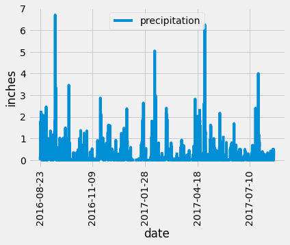
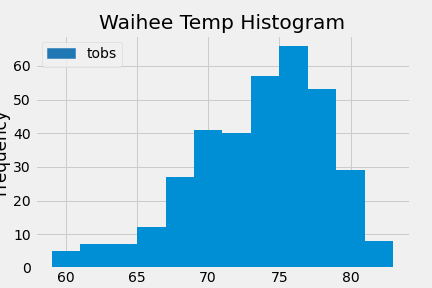
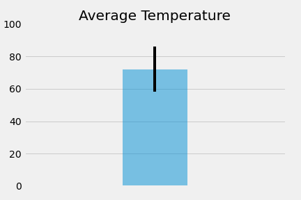

# Sqlalchemy and Flask API - Advanced Data Storage and Retrieval

Used Sqlalchemy to read a sqlite file into Python, then performed analysis and created visualizations with Matplotlib. For the second part of the challenge, designed a Flask API based on queries performed in the first step, and used Flask to create API routes. 

## Table of contents

* [Technologies](#technologies)
* [Installation](#installation)
* [Development Process](#development-process)
* [Data Sources](#data-sources)
* [Contact](#contact)

## Technologies
* Python - version 3.7.6
  * Numpy - 1.18.5
    * mean
  * Matplotlib - 3.2.2 
    * inline - to store plots within jupyter notebook
    * Style - import fivethirtyeight style
    * Pyplot
  * Pandas - 1.0.5
  * Scipy
    * stats
  * datetime
* Sqlalchemy - version 1.3.17
  * automap_base
  * Session
  * create engine
  * func
  * inspect
* Flask
  * jsonify

## Installation and Usage

Run Jupyter Notebook and Flask app in Python environment.

## Development Process
### Part 1
Used Sqlalchemy to connect to a Hawaii weather sqlite database, then reflected tables into classes and saved references as Station and Measurement. Next, analysis was performed on different station and measurement queries, and visualizations of the following queries were created using matplotlib:
1. Plotted all preciptation measurements within selected timeframe as a bar chart:

2. Created a histogram of the last 12 months of temperature observations from Waihee, the station with most observations:
 
3. Created a graph displaying the average temperature with an error bar for the minimum and maxium temperature values:
 

### Part 2
Designed a Flask app based on queries performed in Part 1, and created the following available API routes:
1. /api/v1.0/precipitation
2. /api/v1.0/stations
3. /api/v1.0/tobs
4. /api/v1.0/temp 

## Data Sources
* [Link to local Measurement CSV](Resources/hawaii_measurements.csv)
* [Link to local Station CSV](Resources/hawaii_stations.csv)
* [Link to local sqlite file](Resources/hawaii.sqlite)

## Contact
Created by [Katy Luquire](https://github.com/CatherineLuquire)
